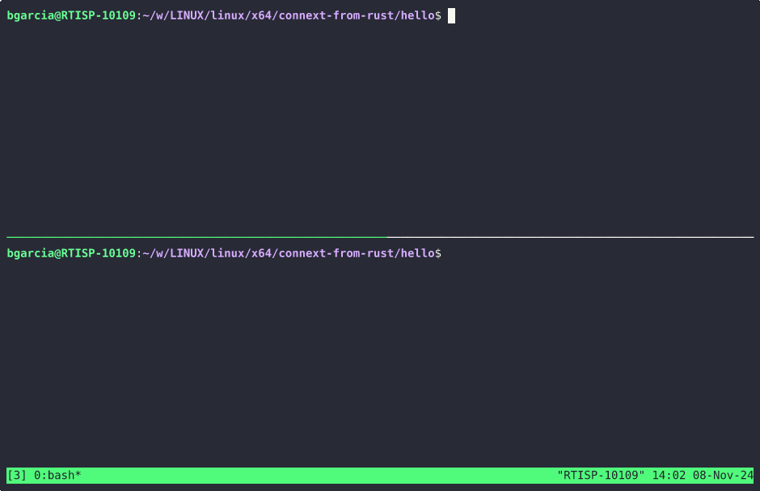

# Connext from Rust

This project demonstrates how to use Connext from Rust on a Linux x64 system.

## Overview

This project is a simple example to get you started with Connext and Rust.

It includes a basic setup and a demonstration of the functionality, and highlights the need for better integrations. Nonetheless this functionality is included
- Automatic rtiddsgen invocation
- Type support library build

## Prerequisites

- Rust installed on your system
- Connext installed and configured
- Linux x64 system

## Installation

1. Clone the repository:
    ```sh
    git clone ssh://git@bitbucket.rti.com:7999/~bgarcia/connext-from-rust.git
    cd connext-from-rust/hello
    ```

2. Build the project:
    ```sh
    export NDDSHOME=path/to/rti_connext_dds-7.3.0
    cargo build
    ```

## Usage

Run the project from a cwd where USER_QOS_PROFILES.xml is located:
```sh
cargo run -- <pub|sub>
```

The project is capable of discovering participants in the loopback interface.

## Demo



## Contributing

Contributions are welcome! Please open an issue or submit a pull request.

## License

This project is licensed under the MIT License.
